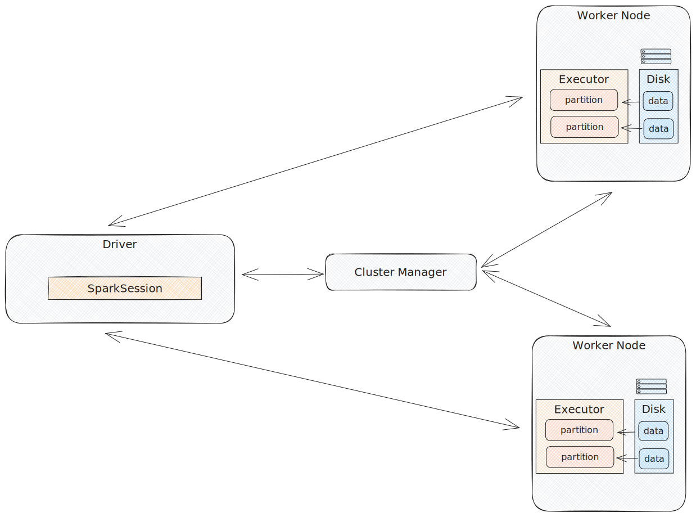
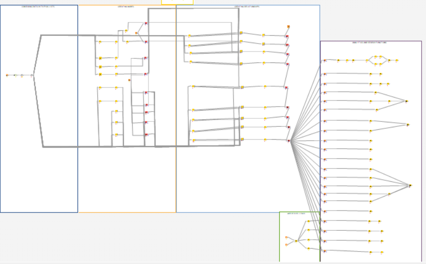
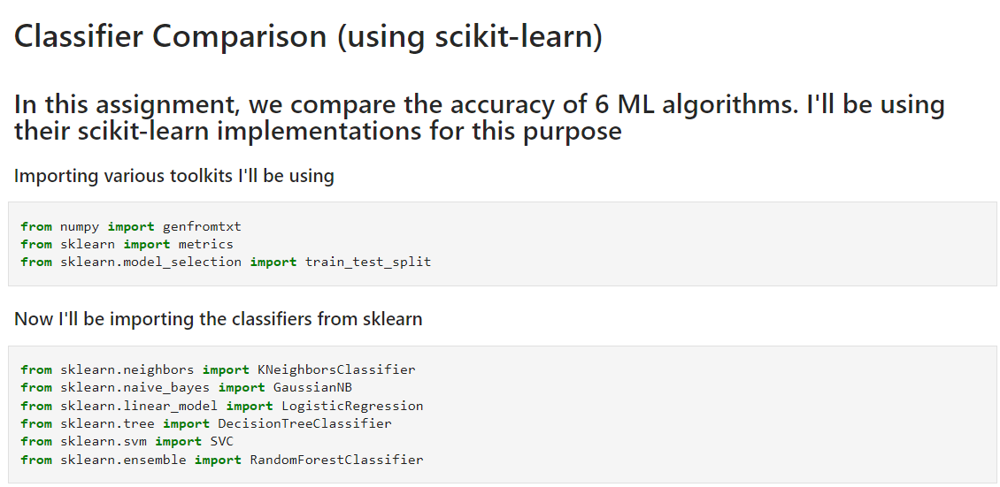
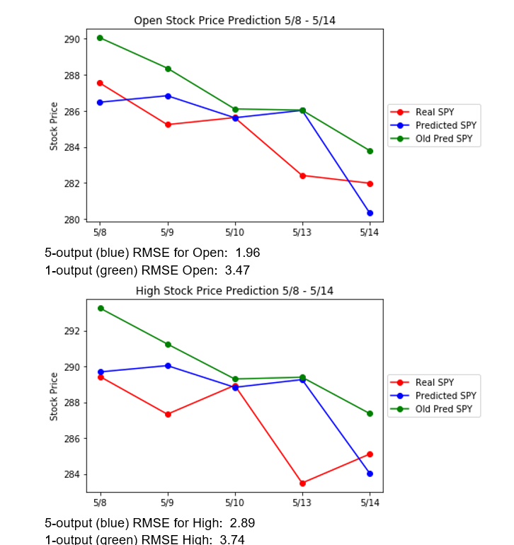
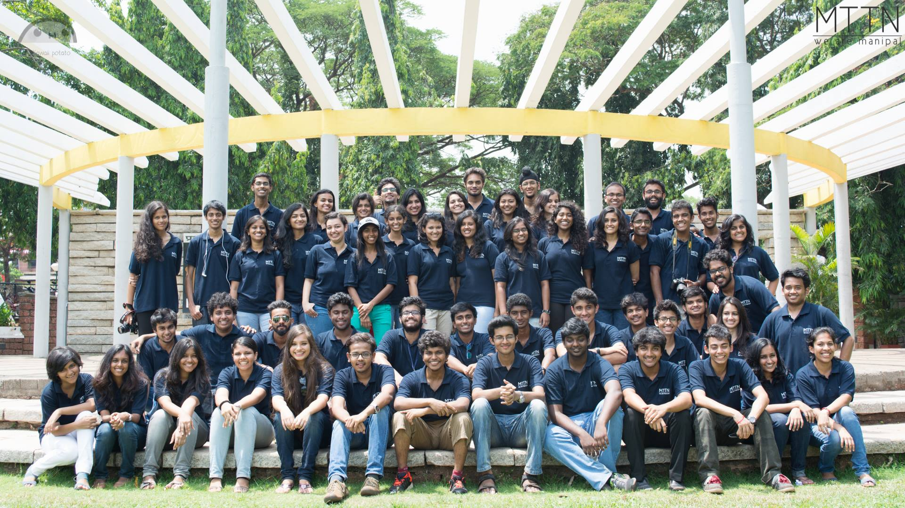

# Data Scientist, Musician, Writer

### MS, Data Science  
Here my master's [thesis on Privacy Preserving ML](https://digitalcommons.njit.edu/theses/1792/) from 2020

# Data Engineering

### (A lot more coming up!)

Wrote a [small article](https://github.com/EruditeStranger/Spark_Docker/tree/main) on Spark once for work to explain to my teammates at Accenture, including what allows Databricks to work well with huge amounts of data.

Created a pipeline that can dynamically create Neo4j graphs from data in Signals Electronic Lab Notebooks. [Here](https://github.com/EruditeStranger/KNIME_Neo4j_UPL/blob/main/README.md) are some imolementation details

Taught a CS-401 Intro to Data Science class 5 years ago. Here's one of the Notebooks I created to introduce students to [Classifiers using Sklearn](https://github.com/EruditeStranger/CS-301-Scikit-Learn)

My friend Michael Lan and I did some time-series analysis on the stock market to make a week's worth of predictions using LSTMs! [Check it out](https://github.com/EruditeStranger/Stock-Market-Analysis)

I currently volunteer as an ML Research Collaborator at a stealth startup, helping develop novel techniques for assisting with data engineering and ML to aid cancer and drug discovery research. Areas of research include using LLMs to automate the code generation process for in-silico research experiments, RLHF, creating a knowledge graph for RAG. For NDA related reasons, I can't make any of the work publicly available but happy to chat about it!

# Cool projects I've been fiddling with since 2011
(This section, much like the website is currently under construction. Please bear with me as I dig through several years worth of work stored away and make them public!)

I was experimenting with Augmented Reality with Unity and Vuforia during my Co-Op with Verizon in 2019. [Here's a video clip playing on my t-shirt, which a small explanation of how I did it](https://www.youtube.com/watch?v=q2IQPzE1uxw)

[Music Recommendation System, hosted using Streamlit and Frozen Flask (WIP)](https://github.com/EruditeStranger/Music_Rec/tree/main)

I created a [web-scraper using Haskell](https://github.com/EruditeStranger/MALHaskellScraper) a while back when I was in the process of learning it

A bunch of Python code using OpenCV to recognize faces in a live stream from a [Computer Vision project I did in 2015](https://github.com/EruditeStranger/Detect-Faces-in-Video)

# Stuff I've been doing outside of tech and the sciences
I was the editor-in-chief at [manipalthetalk.org](manipalthetalk.org) a lifetime ago, a student led media body where I led a team of around 50 people. I was also a writer and senior editor before that, [here's](https://www.manipalthetalk.org/?s=rahul+basu) some of my writing

I'm part of Ohana dragonboat racing team and every year we help with raising money for Boston's beaches by taking a freezing cold plunge at Constitution Beach in March, typically in constumes! Here's a photo from this year!

